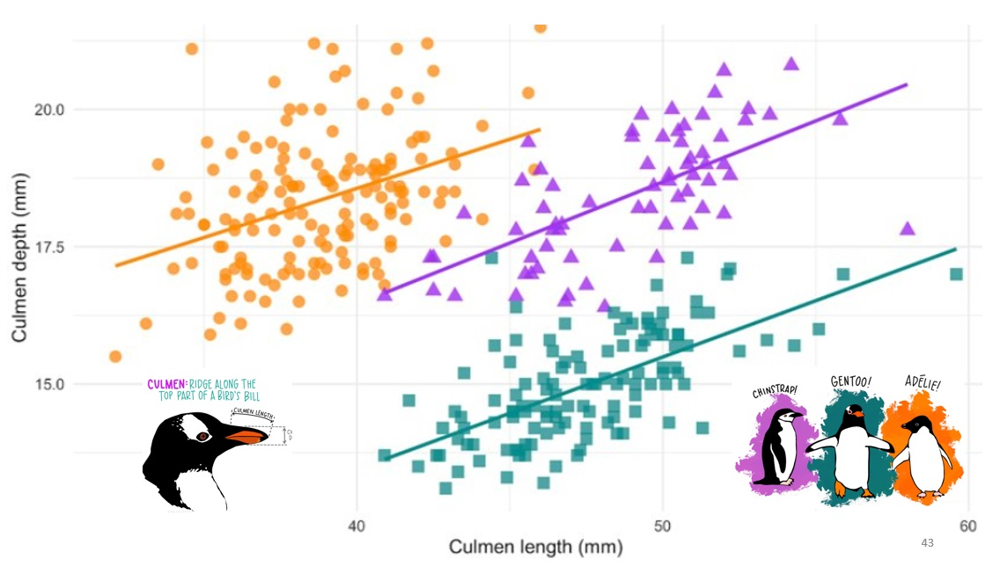

<style>
.column-left{
  float: left;
  width: 60%;
  text-align: left;
}
.column-right{
  float: right;
  width: 30%;
  text-align: right;
}
.column-full{
  float: none;
  width: 100%;
  text-align: left;
}


.RUsers {
  padding: 1em;
  background: aliceblue;
  color: black;
}


.SPSS {
  padding: 1em;
  background: whitesmoke;
  color: black;
}

</style>

```{r setup, include=FALSE}

knitr::opts_chunk$set(echo = FALSE)
knitr::opts_chunk$set(message = FALSE)
knitr::opts_chunk$set(include = FALSE)
knitr::opts_chunk$set(eval = FALSE)


library(knitr)
library(tidyverse)
library(lme4)
library(foreign)
library(modelsummary)
library(janitor)
library(kableExtra)
library(broom)

```


<div class="column-right">

```{r img, eval=TRUE, include=TRUE}

# 
```
</div>

<div class="column-left">
All datafiles can be found in the shared [folder under](https://bit.ly/3puop3I) `datasets`. For testing, use $\alpha=0.05$ unless otherwise specified. 


</div>


# Exercise 1

In this exercise you will practice the use and interpretation of re-centring explanatory variables and the effect of co-linear explanatory variables. Use the data file `practical1_cf.sav` where you can find data from 25 patients with cystic fibrosis. The outcome variable is the index of respiratory muscle strength `pemax` (maximal static expiratory pressure, a measure of malnutrition, in cmH~2~O). We focus on explanatory variable height to predict `pemax` first. 

  a.	Explore the data and make a scatter plot of `pemax` and `height`. Regress `pemax` on `height` and write down the regression equation. Interpret the two regression coefficients. Calculate the confidence intervals for the coefficients. 

  b.	Re-center height around 150 cm (i.e. create a new variable that 'shortens' everyone by 150 cm). Make a new scatter plot and compare this with the previous one. Now repeat the analysis, using this variable as the explanatory variable. What is the interpretation of the coefficients? Compare the results of this model with the previous model. 
  
  
  c.	Based on this model, what is the confidence interval for predicted mean `pemax` for someone with a height of 150 cm?

  d.	Create a new model to predict `pemax` from `weight` instead of height, and a third model with `weight` and `height`. How do the coefficients change and why? Which model would you prefer for predicting `pemax`, and why?

::: { .SPSS }
For **SPSS Users**!

Please use transform $\rightarrow$ compute.
:::


::: { .RUsers }
For **R Users**!

use `m1 <- lm(...)` to estimate  model parameters (intercept and slope) and `confint()` for the confidence intervals of those parameters. To find the confidence interval for the predicted means, use the `predict` function with the argument `interval="confidence"`. If you have more than one model, `m1, m2, m3,...`, you can compare between them using the `modelsummary` command. 

Simply run 

`modelsummary(list(m1, m2, m3,...), stars=TRUE)`

But don't forget to install and load the `modelsummary` library!  

:::

  
    
```{r cf-scatterplot, include=TRUE}

d <- read.spss("data/practical1_cf.sav", to.data.frame = TRUE)
ggplot(d, aes(x=height, y=pemax)) + 
  geom_point() + 
  geom_smooth(formula=y~x, method="lm", level=0.75) + 
  theme_minimal()


```
```{r cf-models, include=FALSE}

mdl.h <- lm(pemax~height, data=d )
predict(mdl, data.frame(height=150), interval="confidence")
mdl.w <- lm(pemax~weight, data=d )
mdl.hw <- lm(pemax~height+weight, data=d )
modelsummary(list(mdl.w, mdl.h, mdl.hw), stars=TRUE)


```


# Exercise 2

You may choose between this exercise and exercise 3 (You may also do both!). 

Imagine we have a random variable $X$, consisting of 100 observations, randomly sampled from a normal distribution with two parameters; its mean is $\mu=3$ and its standard deviation is $\sigma=5$. But you don't know the distribution's paramaters, you cannot observe them directly - you can only observe the values in your sample. 

```{r show-ex2.1, include=TRUE, echo=TRUE, eval=TRUE}

# The following command assures that every time you 
# sample the distribution, you will get the exact same 
# results..
set.seed(111)
X <- rnorm(n=100, mean=3, sd=5)

```

Had you known the parameters of the distribution  $\mu, \sigma$, you would know the probability of observing a certain value $x$ is:
$$P(X=x|\mu, \sigma) = \frac{1}{\sqrt{2\pi}\sigma}e^\frac{(x-\mu)^2}{2\sigma^2} $$ 
The probability of observing multiple independent values  $x_1, x_2, ..., x_n$ is 

$$P(X=x_1, x_2, ... x_n |\mu, \sigma) = \prod_{i=1..n}P(X=x_i|\mu, \sigma) \\
= \prod_{i=1..n}\frac{1}{\sqrt{2\pi}\sigma}e^\frac{(x_i-\mu)^2}{2\sigma^2} $$ 


```{r hide-ex2, eval=TRUE, echo=FALSE, include=FALSE}
library(tidyverse)
library(metR) # <-- this library for the contour plot...

# likelihood: given the parameters of a normal distribution, 
# sigma and mu, what is the probability of observing 
# a certain outcome, x
# p(x|mu,sigma) = dnorm(x, mean=mu, sd=sigma )
lik <- function(x, mu, sigma){
  return(sum(log(dnorm(x, mean=mu, sd=sigma))))  
}

# Now we want to create a data frame with combinations of 
# mu and sd
df <- expand.grid(mu = seq(2,4, b=.02), 
                  sigma = seq(4,6, b=.02))


# Here we calculate the log-likelihood for each combination
df$loglik <- rep(NA, nrow(df))
for(i in 1:nrow(df)){
  mu    <- df$mu[i]
  sigma <- df$sigma[i]
  df$loglik[i] <- lik(X,mu,sigma)
}

# Finally, we plot a heat map and a contour map, 
# a representation of a three dimensional space where the x-axis
# represents the mu, the y-axis represents the standard deviation, 
# and the colour or contour represents the log likelihood.
# df %>%  
#   ggplot(aes(x=mu, y=sigma, 
#              fill=loglik)) +
#   geom_tile()


```

 
<div class="column-right">

```{r show-contour, eval=TRUE, include=TRUE}
b <- c(308, 310, seq(-310.8,-308, by=0.2))
df %>%  
  ggplot(aes(x=mu, y=sigma, 
             z=loglik)) +
  geom_contour(breaks=b) + 
  geom_text_contour(breaks=b) 

```

</div>


This probability is also known as the likelihood. It defines the probability of making a set of observations, assuming that we are drawing from a particular distribution. It is often mathematically more convenient to look at the log of the likelihood. The parameters that maximize the log-likelihood are also known as the log-likelihood estimates of our parameters. In what follows, we are going to calculate a number of combinations of parameters $\mu, \sigma$ and find which combination maximizes the log likelihood for the our observation of $X$. First, we create a function to calculate the log likelihood for our data and for a set of parameters. Then, we create a data-frame with combinations of parameters, where $\mu\in[2,4]$ and $\sigma\in[4,6]$. Notice that this range contains the real parameters: $\mu=3, \sigma=5$. We hope that the log likelihood would be maximized for a combination of parameters in the vicinity of the real parameters. 

a. Create a graph showing the distribution of the log-likelihood. What kind of distribution is it? 

b. What are the values of the parameters $\mu, \sigma$ that maximize the log-likelihood? What is the maximum log-likelihood for those values? How do these values compare to the mean and standard deviation of the random variable $X$ ?

c. BONUS QUESTION: Create a heat-map or a contour map as follows, and identify which parameter values maximize the log likelihood.Are these the parameters you expected? Why or why not? 


```{r show-ex2, eval=FALSE, echo=TRUE, include=TRUE}

library(tidyverse)
library(metR) # <-- this library for the contour plot...

# likelihood: given the parameters of a normal distribution, 
# sigma and mu, what is the probability of observing 
# a certain outcome, x
# p(x|mu,sigma) = dnorm(x, mean=mu, sd=sigma )
lik <- function(x, mu, sigma){
  return(sum(log(dnorm(x, mean=mu, sd=sigma))))  
}

# Now we want to create a data frame with combinations of 
# mu and sigma. You may want to decrease the range of parameters
# or the number of combinations to improve your plot.
df <- expand.grid(mu = seq(2,4, b=.02), 
                  sigma = seq(4,6, b=.02))


# Here we calculate the log-likelihood for each combination
df$loglik <- rep(NA, nrow(df))
for(i in 1:nrow(df)){
  mu    <- df$mu[i]
  sigma <- df$sigma[i]
  df$loglik[i] <- lik(X,mu,sigma)
}

# Finally, we plot a heat map and a contour map, 
# a representation of a three dimensional space where the x-axis
# represents the mu, the y-axis represents the standard deviation, 
# and the colour or contour represents the log likelihood.
df %>%
  ggplot(aes(x=mu, y=sigma,
             fill=loglik)) +
  geom_tile()


df %>%  
  ggplot(aes(x=mu, y=sigma, 
             z=loglik)) +
  geom_contour() + 
  geom_text_contour() 

```


# Exercise 3 

You may choose between this exercise and exercise 2 (You may also choose to do both!). 

In this exercise you may practice interpreting an interaction effect in a linear regression model. The data file `practical1_hyper1.sav` contains data on a study on hypertension among the elderly performed in 1995. We focus on predicting systolic blood pressure (`sbp`)  using variables age and gender (where `gender=1` denotes a female, otherwise: not female).

a.	Create plots  to judge whether systolic blood pressure is related to age, independent of gender, and whether systolic blood pressure is related to gender, independent of age. 

b.	Perform a multiple linear regression using both age and gender and interpret the results. Write down the equation for females (`gender=1`) and a separate equation for non-females (`gender=0`). Compare between the two equations, highlighting similarities and differences. 

c. To test if the difference in slope between the two groups is significantly different from 0, we introduce and test the interaction effect between variables age  and  gender. For this, you may create a new variable (e.g., `ageg`) which is defined as $X_{age}\cdot X_{gender}$. Test the  significance of the associated coefficient in a multiple linear regression analysis containing both this variable and the two main effects (age and gender).

d.	Write down the regression equation for females and for non-females separately. Interpret the coefficients in the two equationsIs the difference in slope significant? 

```{r ex3, eval=TRUE, message=FALSE, warning=FALSE, include=TRUE}
library(foreign)
d <- read.spss("data/practical1_hyper1.sav", to.data.frame = TRUE) %>% 
  mutate(gender=factor(gender))

ggplot(d, aes(x=age, y=sbp, color=gender)) + geom_jitter() + 
  geom_smooth(formula=y~x, method="lm") + 
  theme_minimal() + 
  theme(legend.position = "bottom")

m1 <- lm(sbp ~age, d)
m2 <- lm(sbp ~gender, d)
m3 <- lm(sbp ~age+gender, d)
m4 <- lm(sbp ~(age+gender)^2, d)
modelsummary(list(m1, m2, m3, m4), stars=TRUE, gof_omit="F|B", 
             statistic = NULL, estimate = "{estimate} ({std.error}){stars}")


```

