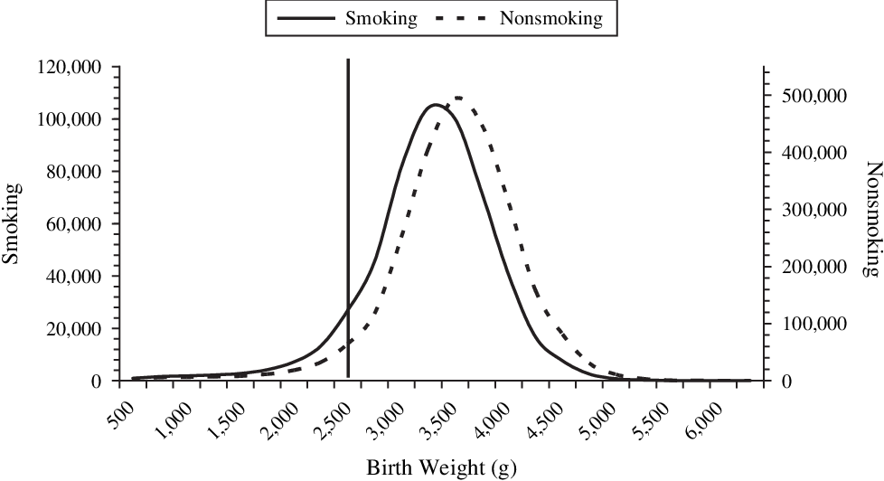

<style>
.column-left{
  float: left;
  width: 60%;
  text-align: left;
}
.column-right{
  float: right;
  width: 40%;
  text-align: right;
}

.column-right-text-left{
  float: right;
  width: 40%;
  text-align: left;
}

.column-full{
  float: none;
  width: 100%;
  text-align: left;
}

.RUsers {
  padding: 1em;
  background: aliceblue;
  color: black;
}


.SPSS {
  padding: 1em;
  background: whitesmoke;
  color: black;
}

.center {
  text-align: center;
}

</style>

```{r setup, include=FALSE}

knitr::opts_chunk$set(echo = FALSE)
knitr::opts_chunk$set(message = FALSE)
knitr::opts_chunk$set(include = FALSE)
knitr::opts_chunk$set(eval = FALSE)


library(knitr)
library(tidyverse)
library(lme4)
library(foreign)
library(modelsummary)
library(janitor)
library(kableExtra)
library(broom)

```


For testing, use $\alpha=0.05$ unless otherwise specified. Datsets can be found under our [shared drive](https://bit.ly/3puop3I). Please do all three exercises. 


# Exercise 1

<div class="column-right-text-left">

```{r bwt-image, eval=TRUE, include=TRUE}



```
Low birth weight (LBW) infants have lower infant mortality in groups in which LBW is most frequent. For example, in 1991, US infants born to smokers had higher risks of both LBW and infant mortality than infants born to nonsmokers. However, among LBW infants, infant mortality was lower for infants born to smokers (relative rate = 0.79). There are competing theories regarding this so-called "paradox.". See [Hernández-Díaz et al, (2006)](https://academic.oup.com/aje/article/164/11/1115/61454).
</div>

This exercise examines the differences between using the linear regression model versus the generalized linear regression model where the distribution of the response variable is considered normal. You will find the data in the file `practical2_lowbwt.sav`. The codebook for this data can be found below


```{r codebook, eval=TRUE, fig.width=4, include=TRUE}

# include_graphics("images/under-construction.png")

tribble(
  ~`column name`, ~`description`, 
  "ID",    "Low Birth Weight Baby (1=Yes under 2500g, 0=No)",
  "LOW",   "Mother's age in years",
  "AGE",   "Weight at Last Period",
  "LWT",   "Race (1=White, 2=Black, 3=Other)",
  "SMOKE", "Smoke during Pregnancy (1=Yes, 0=No)",
  "PTL",   "History of Premature Labour (# of times)",
  "HT",    "History of Hypertension (1=Yes, 0=No)",
  "UI",    "Presence of Uterine Irritability (1=Yes, 0=No)",
  "FTV",   "Visits to Doctor During 1st trimester",
  "BWT",   "Baby's birth Weight in Grams"
) %>%   kbl() %>%
  kable_paper("hover", full_width = F)


```

a. Perform a linear regression of the variable `BWT` (birth weight) on the explanatory variables `SMOKE` and `LWT` (weight of the mother during last menstrual period), and interpret the coefficient associated with the variable `LWT`. 


b. Compare these results with the results of an analysis in `GzLM` (SPSS users) or `glm(...)` (R users) in which you define the distribution of the response variable as normal (let the software create confidence intervals for the regression coefficients). Do the results agree? Where do they differ and *why*? In your answer, please comment on the similarities and difference in the diagnostics when comparing the two  models. 


::: { .RUsers }
For **R Users**!

use `m <- lm(...)` to evaluate the the model and `confint(m)` for the confidence intervals. If you have two models, `m1` and `m2`, you may compare them by using `modelsummary(list(m1, m2), stars=TRUE)`. You will need to install and load the package `modelsummary`.
:::


c. What are the degrees of freedom associated with the two deviance indicators? Explain why these indicators have those values.  

d. BONUS QUESTION: Calculate the deviance for the following: the null model, the residual deviance for the model in part a and for the model in part b. 

::: { .RUsers }
For **R Users**!

to answer these questions, you  to use the residuals of the models, which you can calculate by typing `residuals(m)`, where `m` is your model, the output of the `lm` or `glm` function.

:::


*Remember:* 

* The deviance of a model is simply the sum of the squares of the model's residuals $\sum(y_i-\hat{y}_i)^2$.
* The deviance of the null model is the the deviance of a model that has just an intercept, and is calculated thus `lm(y~1)`. 
* The residual deviance is the deviance of the model we are examining. Ideally, we would like it to be significantly smaller than the null deviance, and close to the model's degrees of freedom. 
* The residual standard error is a measure of goodness of fit. This means, it measures how well a regression model fits a dataset. It is calculated as the square root of the residual deviance divided by the model's degrees of freedom $\sqrt{\frac{D}{df}}$


```{r, include=FALSE, eval=FALSE}

d <- read.spss("data/practical2_lowbwt.sav", to.data.frame = TRUE)
m0 <- lm(BWT ~ 1, data=d)
m1 <- lm(BWT ~ SMOKE + LWT, data=d)
m2 <- glm(BWT ~ SMOKE + LWT, data=d)
confint(m1)
confint(m2)
modelsummary(list(m1, m2), stars=TRUE)

# Calculate the residual standard error: 
sqrt(sum((residuals(m1))^2)/186)

# Calculate the residual deviance 
# For the null model
sum((residuals(m0))^2)
# For  model m2
sum((residuals(m2))^2)
# For model m1
sum((residuals(m1))^2)


```


a.	Make a cross tabulation (aka contingency table) of the variables LOW and SMOKE; print the percentages of LOW within the SMOKE-groups in your cross tabulation as well. What do you conclude from the table about the association between smoking and low birth weight?  

BONUS: If you use `xtabs` in R and the formula `~ SMOKE + LOW`, you can run a chi-square test by typing `summary(xtabs(...))`. Try to run this and interpret the results!


::: {#crosstab .SPSS }
For **SPSS Users**

`Analyze > Descriptive statistics > Crosstabs`


:::

::: {#crosstab .RUsers }


For **R Users**

You could either use the `xtable` command for this, or use the functions from the `janitor` library, namely `tabyl`, `adorn_percentages`,  `adorn_pct_formatting` and `adorn_title`. 


:::


```{r}

xt <- xtabs(data=d, formula = ~ SMOKE + LOW)
xt
summary(xt)

d %>% group_by(SMOKE, LOW) %>% summarise(n.cases=n()) %>% 
  pivot_wider(id_cols=SMOKE, names_from = LOW, values_from = n.cases) %>% 
 adorn_percentages() %>% adorn_pct_formatting(digits = 1) %>% rename(`smoking`=SMOKE, `lowbwt=0`=`0`, `lowbwt=1`=`1`) 


d %>% tabyl(SMOKE, LOW) %>% 
  adorn_percentages("row") %>%
  adorn_pct_formatting(digits = 1) %>%
  adorn_title () 


xt <- xtabs(data=d, formula = ~ SMOKE + LOW)
summary(xt)

```


b.	Perform a logistic regression of the variable LOW on the explanatory variable SMOKE by building a Generalized linear model, using the logit link function. Take LOW as the dependent and SMOKE as predictor. What is the interpretation of the coefficient of SMOKE? Compare your results with the results of the two models you created in the previous exercise. Pay attention to similarities and differences in the diagnostics of the two types of models. Which (if any) of the three models is most informative or useful? 

```{r}

m3 <- glm(LOW ~ SMOKE, data=d, family=binomial)
summary(m3)

```


# Exercise 2


This exercise further explores the Dupuytren data we already encountered in the lectures. It builds and compares various models. You will need to use the file `practical2_dupuytren.sav`. 

a.	Is the probability of having Dupuytren related to Age? Fit a Binomial model with logistic link function compare your results with the results shown in the recorded lecture. Compare the model with and without correcting for over-dispersion. To correct for over dispersion, estimate the scale in two ways: first, using Pearson's chi-square $\hat{\phi}_P=\frac{\chi^2}{N-p}$ and second, using the deviance $\hat{\phi}_D=\frac{D}{N-p}$ (see slide 103.)


::: {#crosstab .RUsers }


For **R Users**

To estimate the `scale`, calculate the sum of squares of Pearson's residuals, which you can find as follows: `residuals(mdl, type="pearson")`. 

You then print out the model using the summary and the dispersion argument as follows: `summary(mdl, dispersion=scale)`. Alternatively, you can calculate the model with over-dispersion directly using `glm` with `family=quasibinomial`.

To calculate the predicted values, use the `predict`  function and add the new data you want to predict in the function call. Make sure you use the correct type for the prediction (`response`) and pass the dispersion you are interested in. When evaluating the 95% confidence interval, use the formula $\hat{Y}\pm1.96*SE$.

:::


```{r, eval=TRUE}

d <- read.spss("data/practical2_dupuytren.sav", to.data.frame = TRUE)
mdl <- glm(cbind(Count, TOTAL-Count) ~ Age, family=binomial, data =d)
scale_p <- sum(residuals(mdl, type="pearson")^2)/df.residual(mdl)
summary(mdl, dispersion=scale_p)

# Alternatively, use...
qmdl <- glm(cbind(Count, TOTAL-Count) ~ Age, 
           family=quasibinomial, data =d)

scale_d <- deviance(mdl)/df.residual(mdl)
summary(mdl, dispersion=scale_d)


```


b.	Predict the 95% CI for the probability to have Dupuytren at the age of 78, according to the Binomial model. Reproduce the graph on slide 92 (see below) and then compare your estimate to the results that can be read off the graph. 

```{r, eval=TRUE, include=TRUE}
xseq <- seq(25,100,by=1)
pred <- predict.glm(mdl, data.frame(Age=xseq), type="response", se.fit=TRUE) 
qpred <- predict.glm(qmdl, data.frame(Age=xseq), type="response", se.fit=TRUE)
pred78 <- predict.glm(qmdl, data.frame(Age=78), 
                      type="response", 
                      se.fit=TRUE)

# 95% CI: pred78$fit +1.96*c(-1,1)*pred78$se.fit
ggplot() + 
  geom_point(data=d, aes(x=Age, y=PROP)) + labs(y="Prevalence") + 
  geom_line(data=data.frame(x=xseq, y=pred$fit), aes(x,y)) +
  geom_ribbon(mapping=aes(x=xseq, 
              ymin=qpred$fit-1.96*qpred$se.fit,      
              ymax=qpred$fit+1.96*qpred$se.fit), alpha=.3)+
  geom_ribbon(mapping=aes(x=xseq, 
              ymin=pred$fit-1.96*pred$se.fit,      
              ymax=pred$fit+1.96*pred$se.fit), alpha=.4) + 
  geom_segment(mapping=aes(x=78, 
                           xend=78, 
                           y=pred78$fit-1.96*pred78$se.fit, 
                           yend=pred78$fit+1.96*pred78$se.fit), size=1,color="red") + 
  scale_x_continuous(breaks=seq(0,100,by=6))+ 
  scale_y_continuous(breaks=seq(0,1,by=.1))


```


::: { .SPSS }

For **SPSS Users**

Add a fictitious case with Age = 78 and Total = 100 to the dataset. Run the analysis again and let SPSS save the predicted value of the mean response and its lower and upper bounds.

:::

 
c.	Fit a Poisson model to the data, with and without a correction for over-dispersion (use Pearson Chi-square). Mind the offset! Compare the results with the results of the lecture. Which model do you prefer, and why?


# Exercise 3: Simpson's Paradox

<div class="column-right">

```{r simps, eval=TRUE, include=TRUE}


```
</div>


In 1973 UC Berkeley was nearly sued for sex-discrimination, all due to an interesting statistical phenomenon called [Simpson's paradox](https://www.youtube.com/watch?v=E_ME4P9fQbo). In this exercise, we are going to investigate the dataset of admissions to UC Berkeley in 1973, which you can find in `practical2_UCBadmit.sav`. The data contains the number of applicants applying and the number accepted to UC Berkeley in 1973. You will then judge whether the data supports the claim, that it may be guilty of sex discrimination.

a. Compare the acceptance rate among male and female applicants to UC Berkeley in 1973. What do you conclude? 

b. Create a table, comparing the acceptance rates among male and female applicants in each department separately. What do you conclude? Are the numbers consistent with those in your answer to the previous question? Explain. 

::: {#crosstab .SPSS }
For **SPSS Users**

You can use the following commands:
`Analyze > Descriptive statistics > Crosstabs`

:::


c. Perform a binomial regression of the applications and admittance on the explanatory variable `applicant.gender` by building a Generalized linear model, and using the logit link function. What is the interpretation of the coefficient of `applicant.gender`? Show that the goodness of fit measures suggest that the model may be inadequate. 

d. The previous model did not correct for over-dispersion. Compare it to a  model that does correct for over-dispersion, estimating the scale in two ways: using Pearson's chi-square and using the deviance.

e. To the model above, add the fixed effects of the departments by creating the appropriate dummy variables. What does this model suggest about the possibility of sex discrimination in acception rates?  


```{r}
d <- read.spss("data/practical2_UCBadmit.sav", to.data.frame = TRUE)
d %>% mutate(rate=admit/applications) %>% 
  select(dept, gender=applicant.gender, rate) %>% 
  pivot_wider(id_cols=dept, names_from=gender, values_from = rate) %>% 
  adorn_pct_formatting()

m1 <- glm(cbind(admit, reject)~applicant.gender, data=d, family=binomial)
qm1 <- glm(cbind(admit, reject)~applicant.gender, data=d, family=quasibinomial)


scale_p <- sum(residuals(m1, type="pearson")^2)/df.residual(m1)
scale_d <- deviance(m1)/df.residual(m1)
summary(qm1)
summary(m1,dispersion=scale_p)
summary(m1,dispersion=scale_d)


m2 <- glm(cbind(admit, reject)~applicant.gender+ dept, data=d, family=binomial)
m3 <- glm(cbind(admit, reject)~(applicant.gender+ dept)^2, data=d, family=binomial)


```


