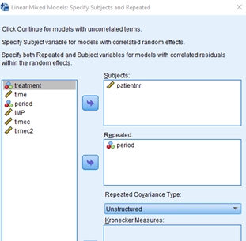
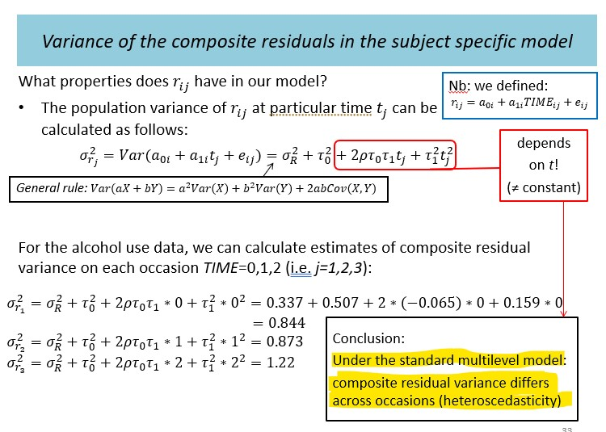

<style>
.column-left{
  float: left;
  width: 60%;
  text-align: left;
}
.column-right{
  float: right;
  width: 40%;
  text-align: right;
  font-size: 10px;
}

.column-right-text-left{
  float: right;
  width: 40%;
  text-align: left;
}

.column-full{
  float: none;
  width: 100%;
  text-align: left;
}

.RUsers {
  padding: 1em;
  background: aliceblue;
  color: black;
}


.SPSS {
  padding: 1em;
  background: whitesmoke;
  color: black;
}

.center {
  text-align: center;
}

</style>

```{r setup, include=FALSE}

knitr::opts_chunk$set(echo = FALSE)
knitr::opts_chunk$set(message = FALSE)
knitr::opts_chunk$set(include = FALSE)
knitr::opts_chunk$set(eval = FALSE)


library(knitr)
library(tidyverse)
library(lme4)
library(foreign)
library(modelsummary)
library(janitor)
library(kableExtra)
library(broom)
library(emo)
library(gridExtra)

```


For testing, use $\alpha=0.05$ unless otherwise specified. Datsets can be found under our [shared drive](https://bit.ly/3puop3I). 


```{r load-imp1, include=TRUE, eval=TRUE}
d <- read.spss("data/practical4_imp1.sav", to.data.frame = TRUE) 

```

# Exercises 1

This exercise examines longitudinal data analyses as shown in the lecture in the context of a different study and data file. You wil focus on the choice of the random part of the model, and various comparisons.

Open the data file `practical4_imp1.sav`. The data consists of an outcome variable IMP (Infant Motor Profile) that is a summary measure for neurological performances in children. IMP is scaled to a percentage from 0 to 100 (higher is better). The children in this study were tested around ages four months, ten months and eighteen months. The variable period indicates the three periods in months (4, 10, and 18), while the variable time is a continuous measure in weeks. The children were born from mothers that were treated for fertility under different conditions: COH-IVF, MNC-IVF, and SUB-NC. The first two groups received IVF treatments with and without ovarian hyper-stimulation, respectively, and the third group is the control group.

a. Investigate the distribution of the `IMP` variable: describe how its distribution changes depending on the period and on the treatment. What are your conclusions just based on the descriptive investigation of this variable? 


```{r dist-IMP, eval=TRUE, echo=FALSE, include=TRUE}

p1 <- d %>% na.omit(IMP) %>%  mutate(period=factor(period)) %>% 
  ggplot() + geom_boxplot(aes(x=period, y=IMP)) 

p2 <- d %>% na.omit(IMP) %>%  mutate(period=factor(period)) %>% 
  ggplot() + geom_density(aes(fill=period, x=IMP), alpha=.4, color=NA)  + theme(legend.position = "bottom")

p3 <- d %>% na.omit(IMP) %>%  mutate(period=factor(period)) %>% 
  ggplot() + geom_density(aes(fill=treatment, x=IMP), alpha=.4, color=NA)  + theme(legend.position = "bottom")

grid.arrange(p1, p2, p3, layout_matrix=rbind(c(1,2),c(3,3)) )

```


b. Make a graph of the `IMP` test scores with respect to the variable `period` or the variable `time`. What can you say about the linearity of the time profile.


::: { .SPSS}

The SPSS syntax for the graph is 

GRAPH  \newline
	  /LINE(MULTIPLE)=MEAN(IMP) BY period BY patientnr.

If you would like to see the graph for each treatment group separately, first use Data–Split File

::: 

::: { .RUsers }

Note that by using `period` instead of `time` as your independent variable, we generate a slightly better looking graphs, but this means that all responses are set at fixed time points (e.g., exactly 4 months), which is not necessarily precise. For evaluation of the time profile it satisfies our goal, though, time seems to influence IMP quadratically (parabolic shape).
:::

```{r show-code-plot, echo=TRUE, eval=FALSE, include=TRUE}
# For *R Users:*
# Try the following: 

d <- read.spss("data/practical4_imp1.sav", to.data.frame = TRUE)

# Separate trajectory for each patient
ggplot(d) + 
  geom_line(aes(y=_____, x=_____, 
    group=_____, color=_____))


# Separate trajectory for each treatment
ggplot(d %>% na.omit(IMP) %>%  group_by(_____, _____) %>% summarize(IMP=mean(_____))) + 
  geom_line(aes(y=_____, x=_____, color=_____))

```


c.	Fit a model with random effects for the intercept and the time effect, and fixed effects for the treatment, the time, the quadratic time and for the relevant interactions. Take the covariance matrix for the intercept and slope (linear time) term unstructured. 

<!-- Create a table comparing the `-2loglikelihood` values, the `AIC`, and `BIC`. What are your conclusions? -->

::: { .RUsers }
*Note to all users*

Before fitting the model, centralize the `time` by subtracting its mean from it, and dividing the result by its standardized deviation. You will find that your new variable `time_c=(time-47)/25`.

You may choose a random effect for the intercept and for the slope of the variable `time_c`, but you will not be able to choose a random effect for quadratic time in your model. Although SPSS will estimate the quadratic term, R would refuse, and rightly so. There are too little observations (3 and sometimes even less per child) to correctly identify a random quadratic term as well. 

Your model will look as follows: 

\begin{aligned}
Y_{IMP} &= b_{0i} + b_{1i}\cdot X_{time_c}+ b_2\cdot X_{trt} + b_3\cdot X_{time_c}^2 + b_4\cdot X_{trt}\cdot X_{time_c} + b_5\cdot X_{trt}\cdot X_{time_c}^2 + e_{ij} \\

b_{0i} &= \beta_{00} + a_{0i} \\
b_{1i} &= \beta_{10} + a_{1i} 

\end{aligned}

*R Users* : 
The formula you will be using in your `lmer` function would look like this (remember to center your `time` variable):

`IMP ~ 1 + treatment + time_c+ time_c2 + treatment*time_c + treatment*time_c2 + (1 + time_c | patientnr)`


:::


```{r ex1-model}

d %>% na.omit(IMP) %>% 
  mutate(time_c  = (time-mean(time))/sd(time), 
             time_c2 = time_c^2, 
             patientnr = factor(patientnr),
             treatment = factor(treatment), 
             period = factor(period))  -> d1


mdl0 <- glm(IMP ~ 1,data=d1)

mdl.re0 <- lmer(IMP ~ 1  + (1 | patientnr),
data=d1, REML=T)


mdl.trt.re1 <- lmer(IMP ~ 1 + treatment + (1 | patientnr),
data=d1, REML=T)

mdl.tim.re1 <- lmer(IMP ~ 1 + time_c + (1 | patientnr),
data=d1, REML=T)

mdl.tim.trt.re1 <- lmer(IMP ~ 1 + treatment + time_c  + (1 | patientnr), data=d1, REML=T)

mdl.tim.trt.re2 <- lmer(IMP ~ 1 + treatment + time_c + time_c2 + (1 | patientnr), data=d1, REML=T)

mdl.tim.trt.re3 <- lmer(IMP ~ 1 + treatment + time_c + time_c2 + treatment*time_c + treatment*time_c2 + (1 | patientnr),
data=d1, REML=T)


mdl.1c          <- lmer(IMP ~ 1 + treatment + time_c + time_c2 + treatment*time_c + treatment*time_c2 + (1 + time_c | patientnr),
data=d1, REML=T)

# Negative correlation between intercept and time slope means that those who have a higher IMP at week 47 would have a more moderate increase of their IMP and the other way around.  
# parameters: total of 13 
# 10 fe 
# 2 re: 1.9161 (intercept), 0.5991 (time_C)
# 1 sigma_r^2 (6.1564 )

# 2*log Lik. = 3111.13 (df=13)

as.data.frame(VarCorr(mdl.1c))$vcov


```


d.	For each of the three treatments, write how the expected `IMP` variable depends on the `time` variable. What are the expected `IMP` scores at periods 4, 10 and 18 months in each of the treatment groups? 

::: { .RUsers }

You will need one equation like the one provided below for each of the three treatments.  
\begin{aligned}

\mathbb{E}[Y_{IMP}|X_{trt} &= \textrm{SUB-NC}] = b_0 + b_1\cdot X_{time_c} + b_2\cdot X^2_{time_c}  \\
&=  b_0 + b_1\cdot (X_{time}-47)/25 + b_2\cdot [(X_{time_c}-47)/25]^2

\end{aligned}

Since $X_{time}$ is measured in weeks and not in months, you may assume that 4 months is about 17 weeks, 10 months is about 44 weeks and 18 months is about 78 weeks.

:::

e.	Fit an unstructured *marginal model* with a mean time trajectory that is again quadratic in time for each treatment. What are the `-2loglikelihood` value, the `AIC` and `BIC`? Compare the values with the best model from previous analyses. 

::: { .RUsers }

For the marginal model we use the `period` variable instead of the `time` variable - but only as  random time factor for the error covariance matrix. 

If we had used the variable `time`, we would have obtained a new category for each unique value of time (since time is quite different for each of the subjects). This model could probably not be fit at all, since the data set would have been too small. 

Furthermore, note that in this model the correlation between observations is independent of the real time differences for subjects at the three periods 4, 10 and 18 months. In other words, the correlation between the IMP for a child at 4.1 and 9.8 is the same as the correlation for a child with time points 3.8 and 10.2, for instance. This is acceptable only if these differences are small and close to each other compared to the distances in the periods. If this is unacceptable, the model proposed here should not have been fitted.


**For R Users**

Estimate the model given the code shown below. We have to add an extra line to tell the analysis to omit missing values (if you leave that out, the analysis will stop).

The variable `period` in the `weights` statement is treated as a categorical variable to be able to generate the variance-covariance matrix across time points. Period has only three levels, which means that R would build a three-dimensional normal distribution for the residuals in the model. 


:::

```{r gls-1.d-show, include=TRUE, eval=FALSE, echo=TRUE}
mdl <- gls(IMP ~ 1 + treatment + time_c + time_c2 + treatment*time_c + treatment*time_c2, 
          data = ________,
          correlation = corSymm(form= ~ 1| patientnr),
          weights= varIdent(form = ~ 1 | period),
          na.action=na.omit,
          method="REML")
```


```{r gls-1.d}
library(nlme)
mdl <- gls(IMP ~ 1 + treatment + time_c + time_c2 + treatment*time_c + treatment*time_c2, 
          data = d1,
          correlation = corSymm(form= ~ 1| patientnr),
          weights= varIdent(form = ~ 1 | period),
          na.action=na.omit,
          method="REML")

summary(mdl)

```


<div class="column-right-text-left">

```{r ex41e-image, eval=TRUE, include=TRUE}


```

The marginal model uses the /REPEATED statement instead of the `/RANDOM` statement (choose `unstructured`).
</div>


::: { .SPSS }
**For SPSS Users**

The marginal model uses the /REPEATED statement instead of the `/RANDOM` statement (choose `unstructured`). Note that we must take `period` in the repeated statement. This is necessary because this variable is treated as a categorical variable to be able to generate the variance-covariance matrix across time points. Period has only three levels, which means that SPSS would built a three-dimensional normal distribution for the residuals in the model. 

:::


f.	Again determine the mean profile for the reference group and provide expected `IMP` scores for 4, 10, and 18 months in this group. Compare your predictions to the results in your previous analysis.


g.	Fit an unstructured marginal model with a mean per `treatment` and `period` (mean saturated model). In other words, this final model ignores the time differences between subjects as a whole (in the variance-covariance and in the mean profile) and assumes that all times can be treated as a categorical variable. What are the `-2loglikelihood` value, the `AIC`, and `BIC`? Compare the values with the best model from previous analyses. Is this comparison allowed? If not what would you do to make the comparison reliable?


::: { .RUsers }

The code is very similar to the previous one, but this time we ignore the time differences between subjects as a whole (in the variance-covariance and in the mean profile) and assume that the times can be treated as a categorical variable. The script is given by: 
 
:::


```{r gls-1.f-show, include=TRUE, eval=FALSE, echo=TRUE}
mdl <- gls(IMP ~ 1 + treatment + period + treatment*period, 
          data = ________,
          correlation = corSymm(form= ~ 1| patientnr),
          weights= varIdent(form = ~ 1 | period),
          na.action=na.omit,
          method="REML")

gls(IMP ~ 1 + treatment + period + treatment*period,
                data = imp1,
                correlation = corSymm(form= ~ 1| patientnr),
                weights= varIdent(form = ~ 1 | period),
                na.action=na.omit,
                method="REML") 

```


h.	What are the expected `IMP` scores at 4, 10 and 18 months? 


::: { .SPSS }
For **SPSS users**

You can get this from the output using `\EMMEANS`.

:::
::: { .RUsers }
For **R users**

Try using `library(emmeans)` and add `mode="df.error"` to circumvent Satterthwaite-related estimation issues.

:::


# Exercise (bonus)

<div class="column-right-text-left">

```{r subjectspecmodel-image, eval=TRUE, include=TRUE}



```
The population variance at time t in the subject specific model. 

</div>

This exercise uses (high-school) mathematics to further investigate properties of the population variance as defined in the subject specific model. 


\begin{aligned}
Y_{ij} &= b_{0i} + b_{1i}\cdot X_{time} + e_{ij} \\

b_{0i} &= \beta_{00} + a_{0i} \\
b_{1i} &= \beta_{10} + a_{1i} \\

&\text{and therefore the composite equation becomes...} \\

Y_{ij} &= \beta_{00} + \beta_{10}\cdot X_{time} + [ a_{0i} + a_{1i}\cdot X_{time} +  e_{ij} ] 

\end{aligned}

Where $a_{0i}$ and $a_{1i}$ covary accoding to the following relationship: 

\begin{aligned}

\begin{gather}
 \begin{bmatrix} 
    a_{0i} \\ 
    a_{1i} 
 \end{bmatrix}
 &\sim \mathcal{N}
 \begin{pmatrix}
  \begin{bmatrix} 
    0 \\ 
    0 
  \end{bmatrix}
 , 
 \begin{bmatrix} 
    \tau_0^2 & \rho\tau_0\tau_1 \\ 
    \rho\tau_0\tau_1 &  \tau_1^2
  \end{bmatrix}
 
 \end{pmatrix}   
   
   
\end{gather}

\end{aligned}

The variance of our residual is now: 

\begin{aligned}
\sigma^2_{r_{ij}} &= Var[a_{0i} + a_{1i}\cdot X_{time} +  e_{ij} ] \\
&= \tau_0^2 + 2\rho\tau_0\cdot\tau_1\cdot X_{time}   + \tau_1^2 \cdot X_{time}^2 + \sigma^2_r

\end{aligned}

Your job is to find the value $X_{time}$, that will minimize the total variance $\sigma^2_{r_{ij}}$. In other words, you need to take the derivative of the total variance and show that it is minimized for 
$X_{time}= -\rho\frac{\tau_0}{\tau_1}$, and that the smallest variance equals $(1-\rho^2)\cdot\tau_0^2+\sigma^2_r$