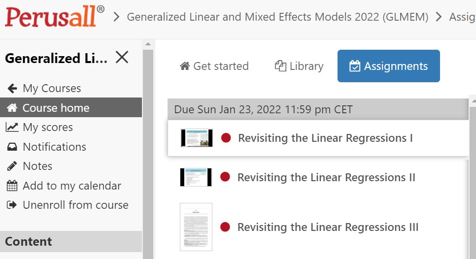

<style>
.column-left{
  float: left;
  width: 60%;
  text-align: left;
}
.column-right{
  float: right;
  width: 40%;
  text-align: right;
  padding-left: 10px;
}
.column-full{
  float: none;
  width: 100%;
  text-align: left;
}
</style>

```{r setup, include=FALSE}
knitr::opts_chunk$set(echo = F)
library(knitr)
```

<div class="column-left">
What is to be done when different groups in the population exhibit very different properties and relationships between properties? What errors might we make when we aggregate all the data together and analyse it as one? And how do we avoid these errors if we are not sure which groups are we to consider together and which should we consider apart? 

This is an applied course in how to extend the linear regression models in a way that would be more amenable to causal analysis. 

</div>


<div class="column-right">
```{r course-structure, fig.width=4}

# include_graphics("images/index-penguins.jpg")
```
</div>

### Aim: 

* Explore (clustered) data and apply generalized linear and mixed effects models (multilevel models)
* Understand the theory of (generalized) linear mixed effects models for cross-sectional and longitudinal data, for numerical, dichotomous and count outcome variables
* Build, examine, interpret, expand and compare these models using GEE or (RE)ML estimation
* Perform these techniques using SPSS or R using practical examples(or any other statistical software packages, self-study)

### Method

The course is designed to follow the flipped-classroom approach. Readings and videos of the lectures are available before the course begins. You will be expected to read the relevant chapters in the textbook, watch the videos, and comment on them in Perusall PRIOR to attending the course. 
During the course itself, you will work on quizzes and lab assignments, which you may then submit at the end of each day. 


<div class="column-left">

#### Prepare

To prepare for the course, please complete the assignments, all available on the Perusall platform. You can find the assignments in Nestor under `Assignments`.  You then need to click on the title of the item: `CLICK ME to access Perusall`. 

Completing the assignment involves watching the video and reading the text before the assigned deadlines. Completing the assignments will contribute towards your attendance and participation in the course. 

</div>


<div class="column-right">
```{r perusall, fig.width=4}



```
</div>


### Grading 

* *Partial course option:* Attendance and participation will reward you with a certificate for 1.5 ECT’s
* *Full course option:* an additional 0.5 ECT is added for lab reports with solutions to exercises (You may submit assignments using either SPSS or R). To pass, your lab reports must demonstrate problem solving skills based on the content of the course, and consist of full, final and complete solutions to the problems.


### Resources

Online (Nestor, Perusall, github): lectures, presentations, data-sets and exercises and background literature

You will find the slides and the datasets in this [shared driver](https://bit.ly/3puop3I). You will need to first log into your rug.nl account in order to access the files. 

Further information can be found in the textbook (Chapters available through a link on [nestor](https://nestor.rug.nl/webapps/blackboard/execute/modulepage/view?course_id=_401842_1&cmp_tab_id=_987516_1)): 
Julian J. Faraway. Extending the linear model with R. Generalized Linear, Mixed Effects and Nonparametric Regression Models. 

... which was used as the framework for this course.  Additional material (data, updates, errata) can be found in the following [webpage.](people.bath.ac.uk/jjf23/ELM ) 

To brush up on your R programming skills, there are a variety of free resources you can use, such as the [SICSS bootcamp](https://sicss.io/boot_camp/), Harvard’s famous [R Basics course](https://www.edx.org/course/data-science-r-basics), or Stanford’s [R Programming fundamentals](https://www.edx.org/course/r-programming-fundamentals). If you speak German, [this site](https://shiny.lmes.uni-potsdam.de/startR/) is quite nice.

You may work and submit your assignments on any other statistical software including SPSS, STATA, Python or Julia. However, as R is becoming the lingua franca of data science in many academic circles, this is going to be the default technology used in this course. 


```{r penguins, fig.width=4}

# 
include_graphics("images/index-penguins.jpg")

```


